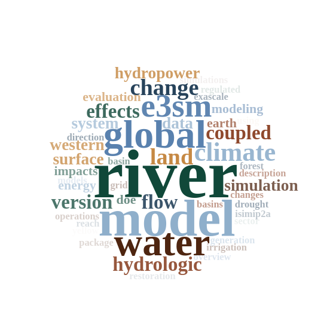

Hello, my name is Tian and I am an earth scientist at [Pacific Northwest National Laboratory](https://www.pnnl.gov/people/tian-zhou) located in Richland, Washington, USA. I received my Bachelor's and Master's degrees in Geosciences and Quaternary Geology from [Lanzhou University](https://en.lzu.edu.cn/) in China. In 2007, I relocated to the United States and earned my PhD in Water Resources Engineering from the State University of New York College of Environmental Science and Forestry ([SUNY-ESF](https://www.esf.edu/ere/)). After working as a postdoctoral researcher in the Land Surface Hydrology Group (later [Computational Hydrology Group](https://uw-hydro.github.io/)) at the University of Washington for three years, I joined Pacific Northwest National Laboratory as a postdoctoral researcher before being promoted to a staff scientist.

My research focus is on hydrological processes at various spatial and temporal scales. I have investigated a range of topics in my career, including (from earliest to most recent):

- The cause of the Yellow River cutting off the Shanxi-Shaanxi George (Lanzhou University)
- The impact of river restoration on surface flow hydrodynamics and hyporheic flows (SUNY-ESF)
- The use of TRMM near-real-time products for flood forecasting (University of Washington)
- The comparison of man-made reservoir variations with natural water storage variations, such as soil moisture and snow water equivalent, at a global scale (University of Washington)
- The effects of upstream dam operations on hyporheic exchange patterns in the Columbia River (PNNL)
- Future projections for hydropower generation in the United States (PNNL)
- Assessing irrigation water allocations from both surface and groundwater sources (PNNL)
- Characterizing the spatial and temporal patterns of global floods (PNNL)
- Integrating land, ocean, and river components in the [Energy Exascale Earth System Model](https://e3sm.org/) (E3SM) (PNNL)

Down below is a cloud map of my research interest generated by [this website](https://shiny.rcg.sfu.ca/u/rdmorin/scholar_googler2/):

In my leisure time, I enjoy outdoor activities such as hiking and biking, as well as traveling. I am also an enthusiastic landscape photographer, capturing the stunning beauty of nature through my lens. My photography can be viewed [here](https://www.flickr.com/photos/tizhou/albums).
