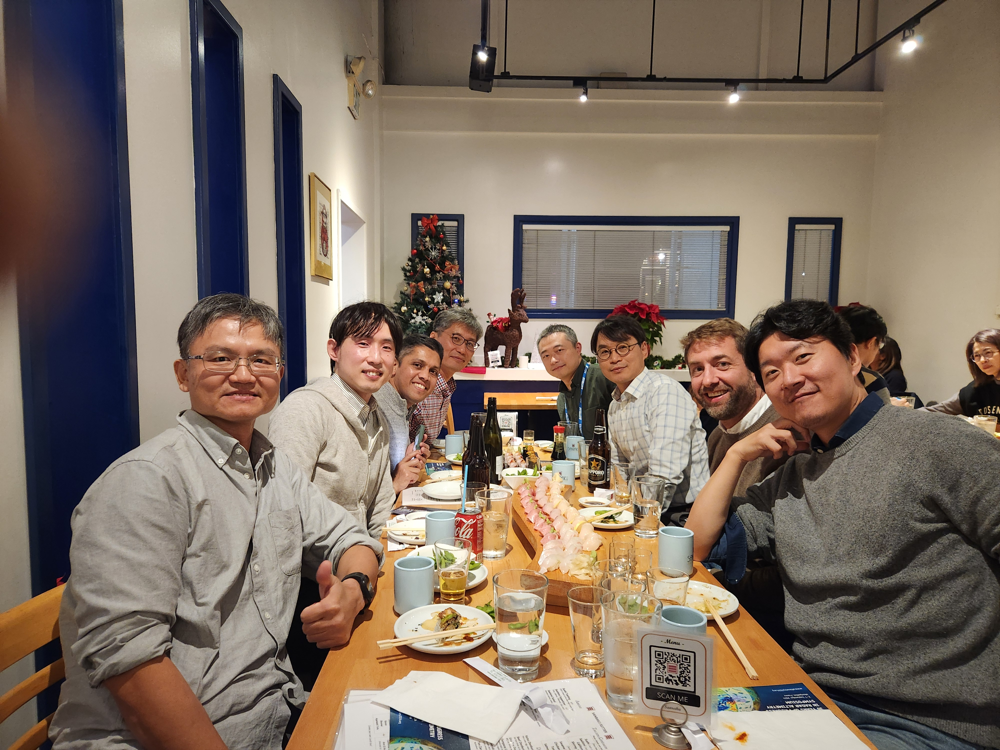

### Dec. 2023
- Met so many old and new friends in [AGU23](https://www.agu.org/fall-meeting). Presented our Inter-basin water transfer work.

### Nov. 2023
- Bryce's E3SMv1 CONUS water budget [metrics paper](../_publications/2023-E3SMv1-CONUS.md) finally got published!

### Oct. 2023
- Chang's [HexWatershed Part II paper](../_publications/2023-Hexwatershed-P2.md) is accepted by JAMES
- Matt's [JOSS paper about baseflow analysis tool](https://joss.theoj.org/papers/10.21105/joss.05492) is published

### Sep. 2023
- Benjamin's [E3SM-ADCIRC paper](../_publications/2023-MOSART-ADCIRC.md) is published on Natural Hazards
- First batch of IRRMIP data simulated by E3SM transferred to Yi Yao through Globus. I had to create a new account in VUB as a volunteer to link VUB HPC endponts to my Globus account.

### Aug. 2023
- Submitted an abstract to this AGU Fall meeting.

### Jul. 2023
- Happy to host Yi Yao's PNNL visit.
- Qi Tang's [E3SM v2 RRM paper](../_publications/2023-E3SMv2-regional-refined.md) is published on GMD

### Jun. 2023
- Attended the "Irrigation in the Earth System" [workshop](https://www.agci.org/workshops/7014x0000002IxWAAU/irrigation-in-the-earth-system-priorities-for-data-modeling-and-cross-disciplinary-research) organized by the [Aspen Global Change Institute](https://www.agci.org/). Very informative discussions.
- Attended the E3SM all-hands meeting in Denver, CO
- Collaborate with Chang, Matt, and Zeli on a [NASA ROSES](https://nspires.nasaprs.com/external/solicitations/summary.do?solId=%7b274C8365-A038-339F-A3AE-8F5BFE178312%7d&path=&method=init) proposal submission

### May 2023
- Collaborate with LANL team for a [BRaVE](https://www.energy.gov/science/articles/department-energy-announces-105-million-research-support-biopreparedness-research) prospsal submission

### Apr. 2023
- FAIR proposal submitted

### Feb. 2023
- I'm excited to work with Ted again on developing a proposal in response to the DOE's [FAIR](https://science.osti.gov/Initiatives/FAIR/Funding-Opportunities) call.
- Attend EBSD mini-conference in PNNL campus.
- [9505v2 paper](../_publications/2023-ERL-9505v3.md) is published by ERL.

### Jan. 2023
- Matt's [baseflow paper](../_publications/2023-WRR-baseflow.md) is published on WRR.

## [older updates](https://simhydro.com/older_updates/)

[comment]: <> (<a class="twitter-timeline" data-height="300" href="https://twitter.com/tianzhou?ref_src=twsrc%5Etfw">Tweets by tianzhou</a> )

<!-- hitwebcounter Code START -->
