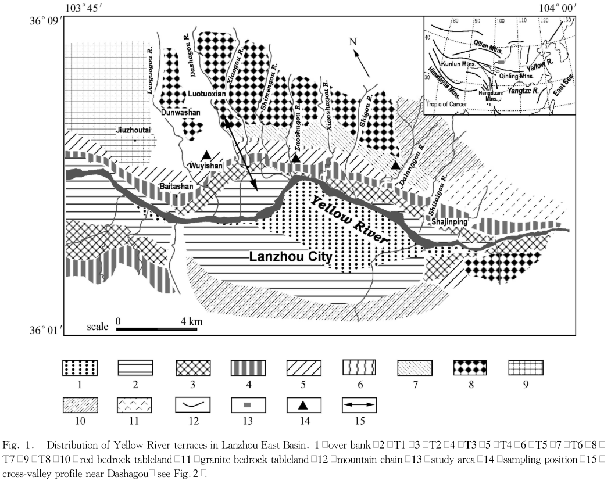

This paper reports the 4th terrace of Yellow River in Lanzhou area

[Link to the paper](https://www.tandfonline.com/doi/abs/10.1080/10020070612331343246)

Recommended citation: Baotian, P., Huai, S., Chunsheng, H., Ziaofei, H., Tian, Z., & Jijun, L. (2007). Discovery of a 1.0 Ma Yellow River Terrace and redating of the fourth Yellow River terrace in Lanzhou area. Progress in Natural Science, 17, 197-205.