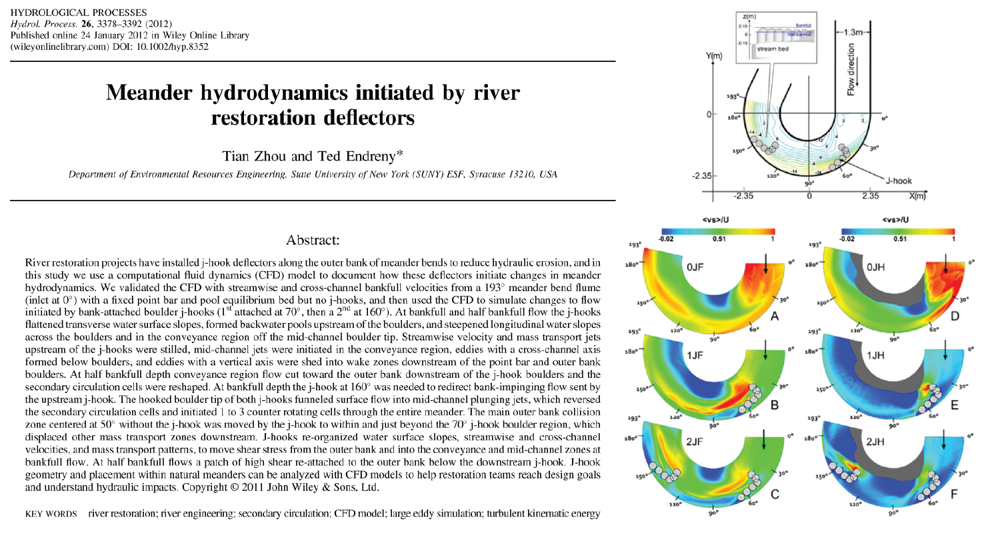

River restoration structure changes surface water hydrodynamics

[Download paper here](https://doi.org/10.1002/hyp.8352)

Recommended citation: Zhou, T., & Endreny, T. (2012). Meander hydrodynamics initiated by river restoration deflectors. Hydrological Processes, 26(22), 3378-3392.