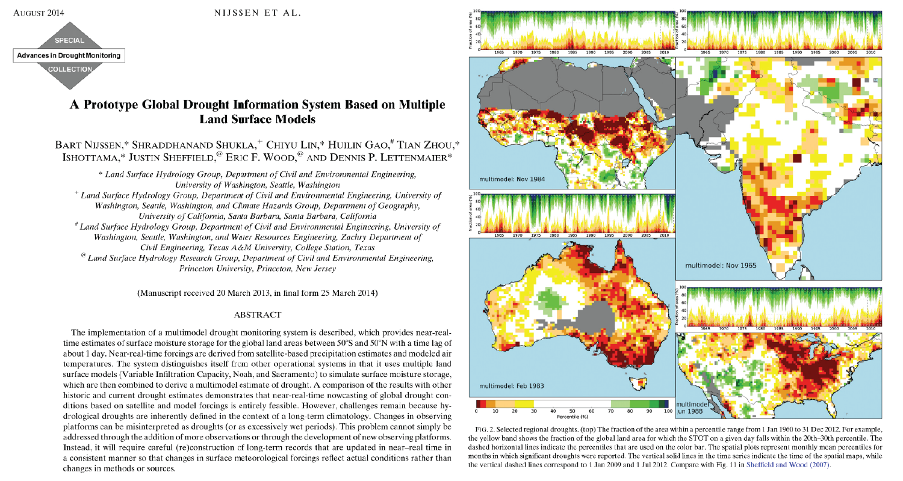

This paper is about a global drought monitoring system based on VIC model

[Link to the paper](https://doi.org/10.1175/JHM-D-13-090.1)

Recommended citation: Nijssen, B., Shukla, S., Lin, C., Gao, H., Zhou, T., Ishottama, Sheffield, J., Wood, E. F., & Lettenmaier, D. P. (2014). A Prototype Global Drought Information System Based on Multiple Land Surface Models. Journal of hydrometeorology, 15, 1661-1676.