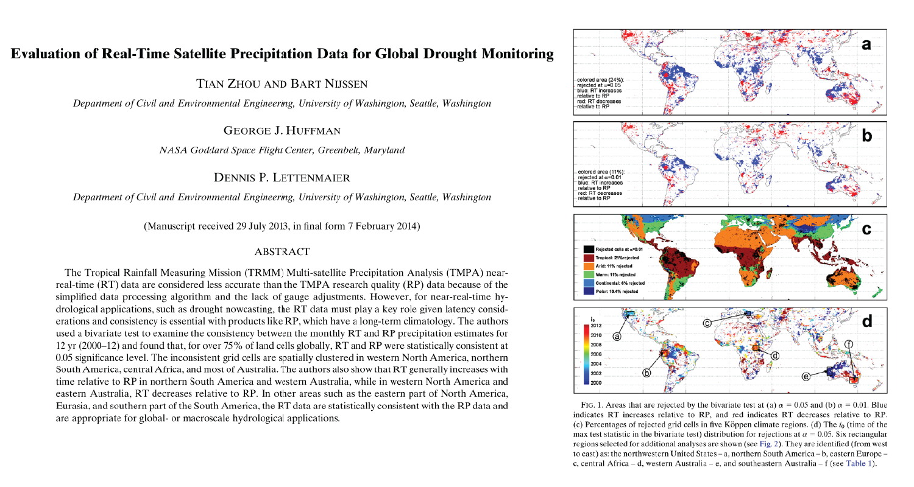

This study evaluates the difference between TRMM-real time (RT) and TRMM-research product (RP)

[Link to the paper](https://doi.org/10.1175/JHM-D-13-0128.1)

Recommended citation: Zhou, T., Nijssen, B., Huffman, G. J., & Lettenmaier, D. P. (2014). Evaluation of Real-Time Satellite Precipitation Data for Global Drought Monitoring. Journal of hydrometeorology, 15, 1651-1660.