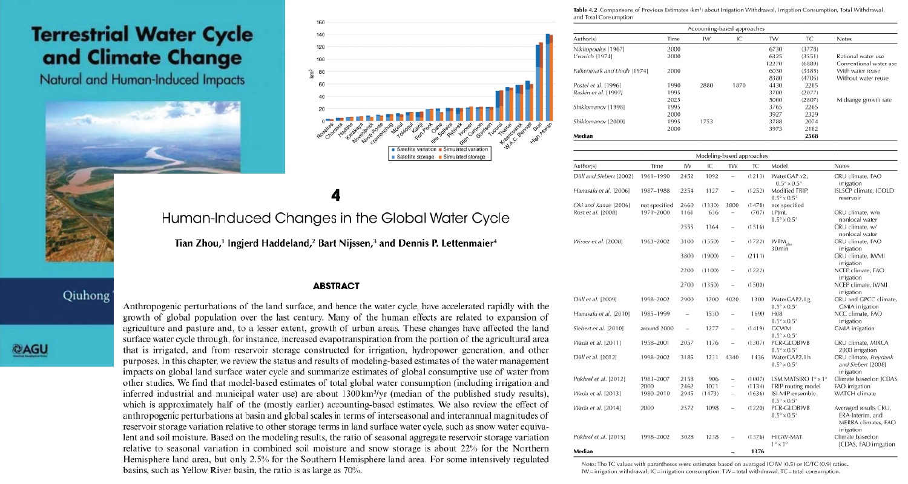

This is a book chapter for AGU monograph about human impact on land surface water budget

[Link to the paper](https://doi.org/10.1002/9781118971772.ch4)

Recommended citation: Zhou, T., Haddeland, I., Nijssen, B., & Lettenmaier, D. P. (2016). Human-Induced Changes in the Global Water Cycle. In Q. Tang & T. Oki (Eds.), Terrestrial Water Cycle and Climate Change (pp. 55-69). John Wiley & Sons, Inc.