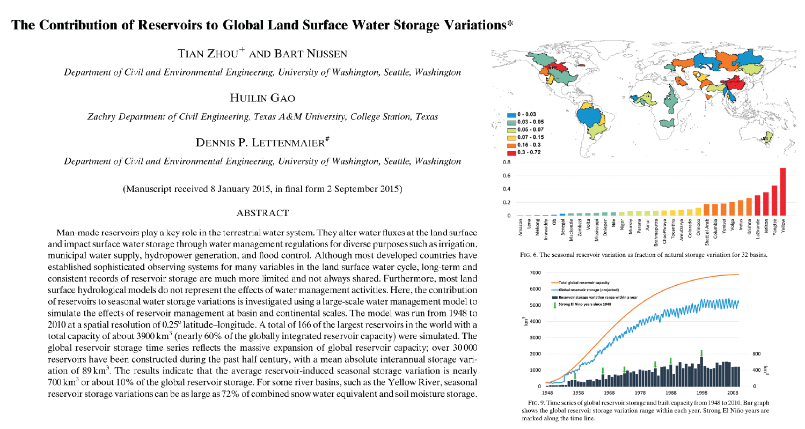

This study investigates human-induced water storage (reservoirs) variation and compares it with natural variations (SWE, soil moisture)

[Link to the paper](https://doi.org/10.1175/JHM-D-15-0002.1)

