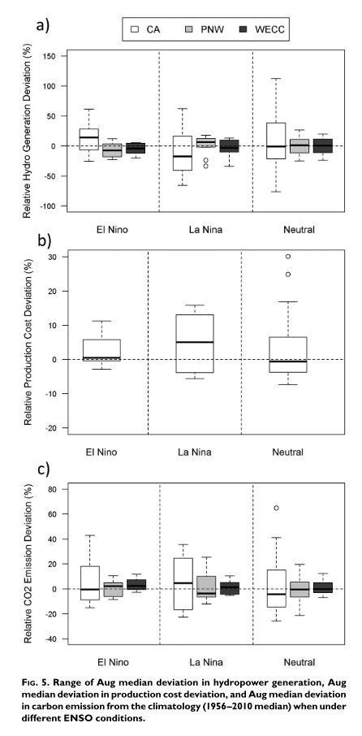

This paper assesses the vulnerability of the current western U.S. grid to historical climate variability using multiple energy and water system models

[Link to the paper](https://doi.org/10.1175/BAMS-D-16-0253.1)

