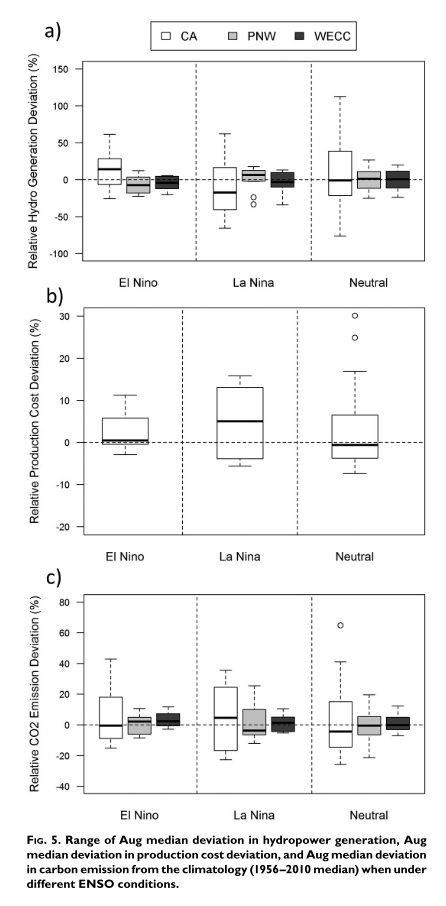

This paper assesses the vulnerability of the current western U.S. grid to historical climate variability using multiple energy and water system models

[Link to the paper](https://doi.org/10.1175/BAMS-D-16-0253.1)

Recommended citation: Voisin, N., Kintner-Meyer, M., Wu, D., Skaggs, R., Fu, T., Zhou, T., Nguyen, T., & Kraucunas, I. (2018). Opportunities for Joint Water-Energy Management: Sensitivity of the 2010 Western U.S. Electricity Grid Operations to Climate Oscillations. Bulletin of the American Meteorological Society