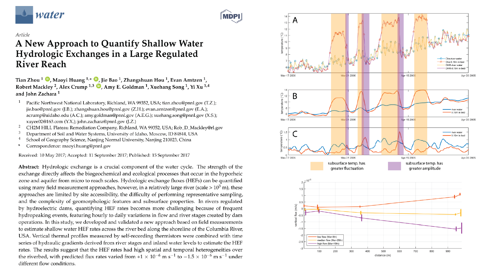

This paper uses streambed temperature to predict vertical hydrologic exchange rate in Columbia River

[Link to the paper](https://doi.org/10.3390/w9090703)

Recommended citation: Zhou, T., Huang, M., Bao, J., Hou, Z., Arntzen, E., Mackley, R., Crump, A., Goldman, A., Song, X., Xu, Y., & Zachara, J. (2017). A New Approach to Quantify Shallow Water Hydrologic Exchanges in a Large Regulated River Reach. Water, 9, 703.