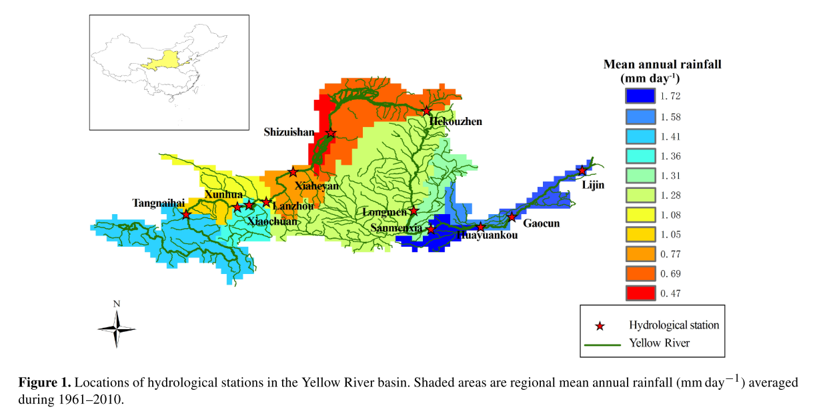

This paper discusses drought events in Yellow River basin

[Link to the paper](https://doi.org/10.5194/hess-21-5477-2017)

Recommended citation: Yuan, X., Zhang, M., Wang, L., & Zhou, T. (2017). Understanding and seasonal forecasting of hydrological drought in the Anthropocene. Hydrology and Earth System Sciences, 21, 5477-5492.