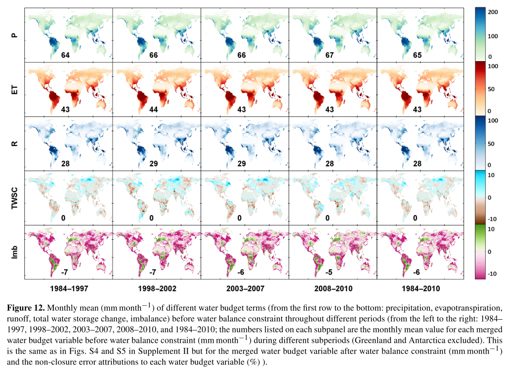

This paper describes a dataset about global terrestrial water budget variables

[Link to the paper](https://doi.org/10.5194/hess-22-241-2018)

Recommended citation: Zhang, Y., Pan, M., Sheffield, J., Siemann, A., Fisher, C., Liang, M., Beck, H., Wanders, N., MacCracken, R., Houser, P. R., Zhou, T., Lettenmaier, D. P., Ma, Y., Pinker, R. T., Bytheway, J., Kummerow, C. D., & Wood, E. F. (2018). A Climate Data Record (CDR) for the global terrestrial water budget: 1984-2010. Hydrology and Earth System Sciences, 22, 1-40.