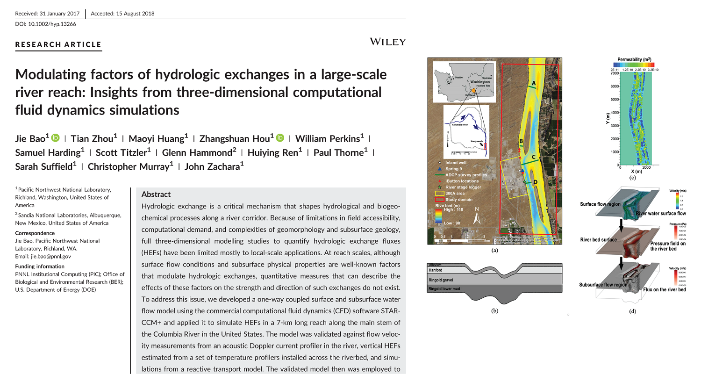

This paper investigates the major control factors of hydrologic exchange in a 7km Columbia River reach

[Link to the paper](https://doi.org/10.1002/hyp.13266)

Recommended citation: Bao, J., Zhou, T., Huang, M., Hou, Z., Perkins, W., Harding, S., Titzler, S., Hammond, G., Ren, H., Thorne, P., Suffield, S., Murray, C., & Zachara, J. (2018). Modulating factors of hydrologic exchanges in a large-scale river reach: Insights from three-dimensional computational fluid dynamics simulations. Hydrological Processes, 32, 3446-3463.  