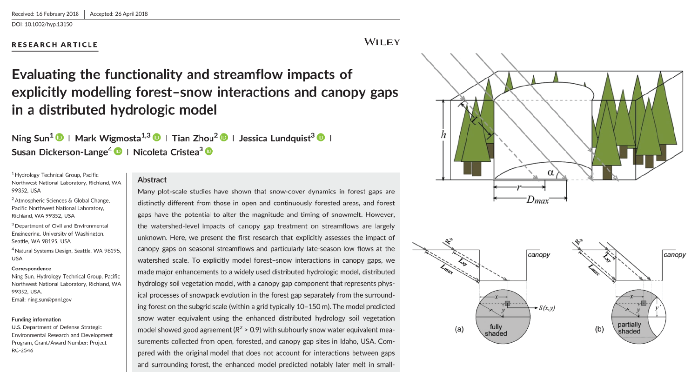

This paper examines the effect of forest gaps on snow processes

[Link to the paper](https://doi.org/10.1002/hyp.13150)

Recommended citation: Sun, N., Wigmosta, M., Zhou, T., Lundquist, J., Dickerson-Lange, S., & Cristea, N. (2018). Evaluating the functionality and streamflow impacts of explicitly modelling forest-snow interactions and canopy gaps in a distributed hydrologic model. Hydrological Processes, 32, 2128-2140. 