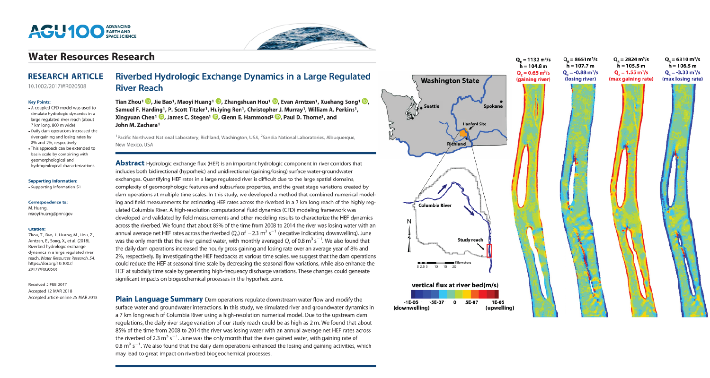

This paper examines how upstream dam operations controls downstream hydrologic exchange patterns

[Link to the paper](https://doi.org/10.1002/2017WR020508)

Recommended citation: Zhou, T., Bao, J., Huang, M., Hou, Z., Arntzen, E., Song, X., Harding, S. F., Titzler, P. S., Ren, H., Murray, C. J., Perkins, W. A., Chen, X., Stegen, J. C., Hammond, G. E., Thorne, P. D., Zachara, J. M., Titzler, S., Ren, H., Murray, C. J., . . .  Zachara, J. M. (2018). Riverbed Hydrologic Exchange Dynamics in a Large Regulated River Reach. Water Resources Research, 54, 1-16. 