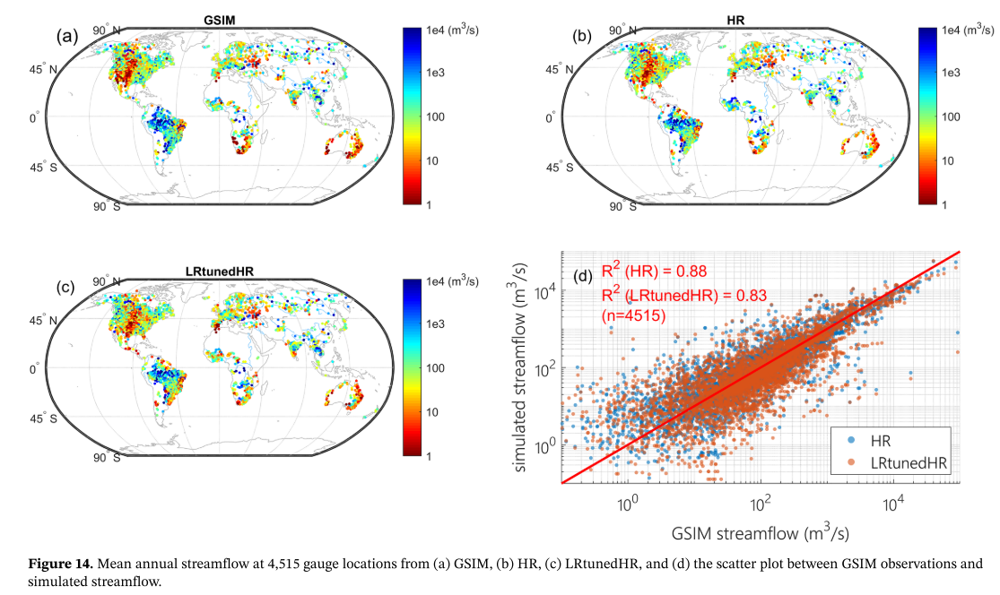

This paper overviews E3SM V1 at high resolution configuration

[Link to the paper](https://doi.org/10.1029/2019MS001870)

Recommended citation: Caldwell, P. M., Mametjanov, A., Tang, Q., Van Roekel, L. P., Golaz, J. C., Lin, W., Bader, D. C., Keen, N. D., Feng, Y., Jacob, R., Maltrud, M. E., Roberts, A. F., Taylor, M. A., Veneziani, M., Wang, H., Wolfe, J. D., Balaguru, K., Cameron?Smith, P., Dong, L., . . . Zhou, T. (2019). The DOE E3SM Coupled Model Version 1: Description and Results at High Resolution. Journal of Advances in Modeling Earth Systems.