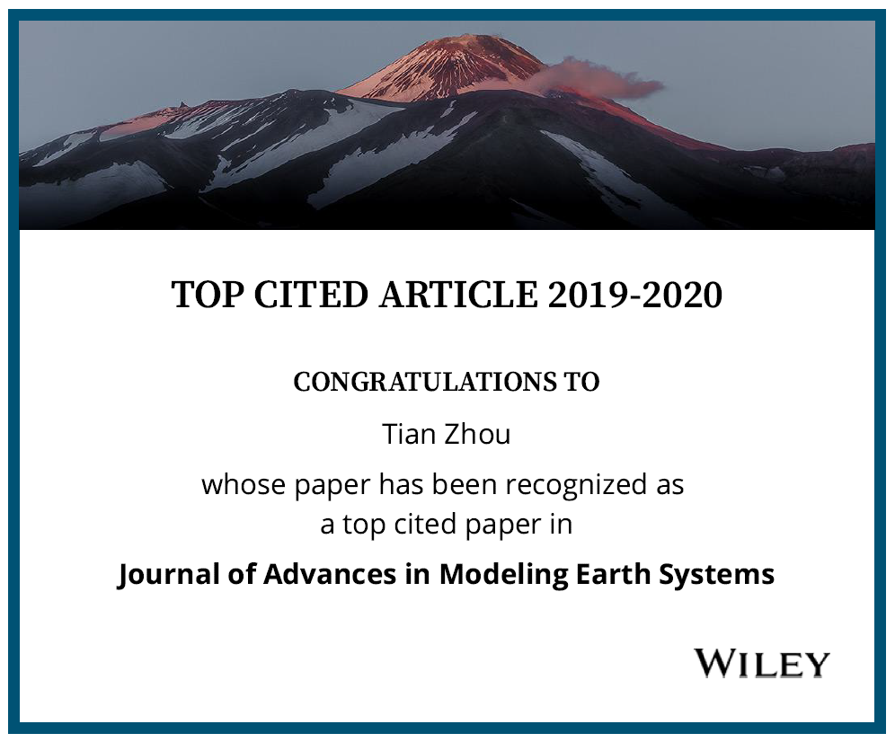
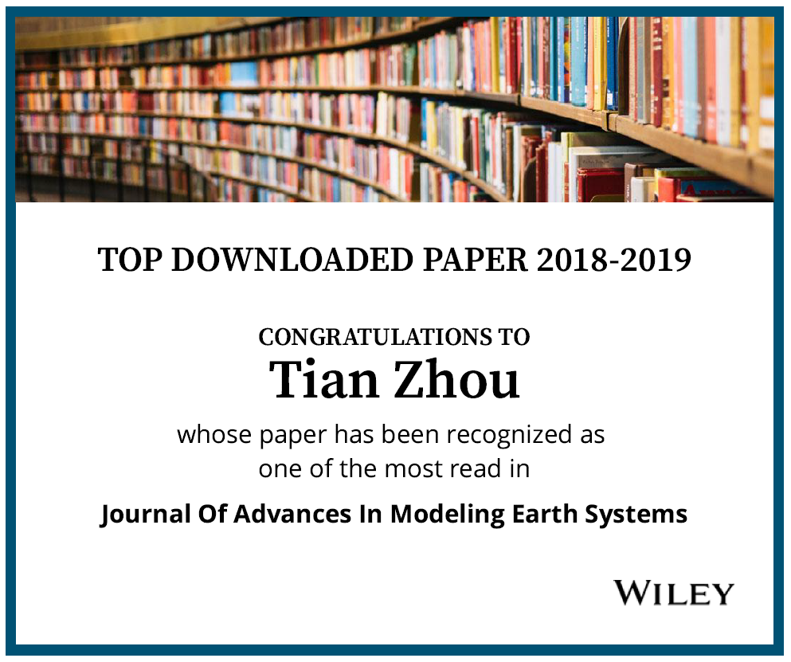
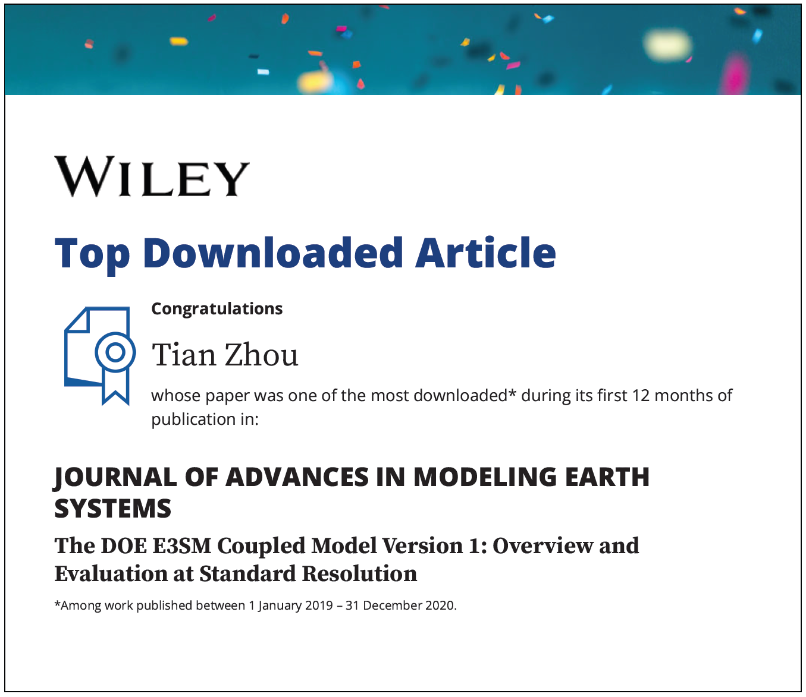

This paper overviews E3SM V1 at standard resolution configuration

[Link to the paper](https://doi.org/10.1029/2018MS001603)

Recommended citation: Golaz, J. C., Caldwell, P. M., Van Roekel, L. P., Petersen, M. R., Tang, Q., Wolfe, J. D., ... & Baldwin, S. A. (2019). The DOE E3SM coupled model version 1: Overview and evaluation at standard resolution. Journal of Advances in Modeling Earth Systems, 11(7), 2089-2129.