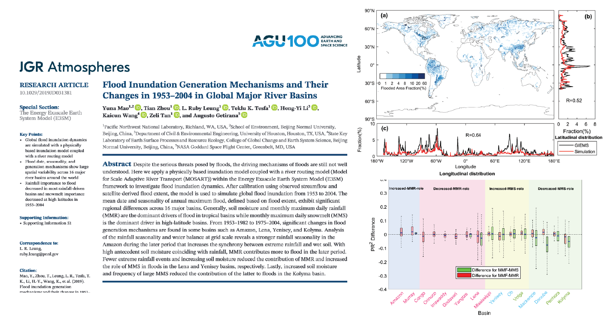

This paper used MOSART-inundation to investigate global flood characteristics and the shift of flood generating factors over 50 year period

[Link to the paper](https://doi.org/10.1029/2019JD031381)

