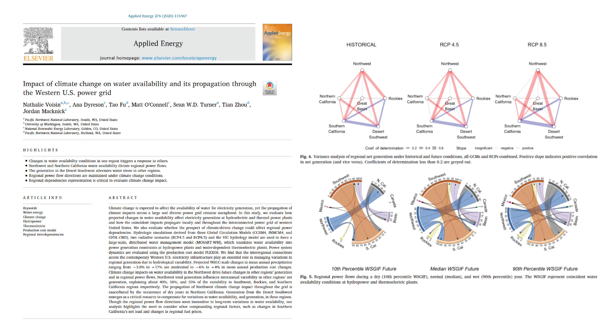

This paper evaluates how projected changes in water availability affect electricity generation at hydroelectric and thermal power plants and how the coincident impacts propagate locally and throughout the interconnected power grid of western United States

[Link to the paper](https://doi.org/10.1016/j.apenergy.2020.115467)

Recommended citation: Voisin, N., Dyreson, A., Fu, T., O'Connell, M., Turner, S. W. D., Zhou, T., & Macknick, J. (2020). Impact of climate change on water availability and its propagation through the Western U.S. power grid. Applied Energy, 276.