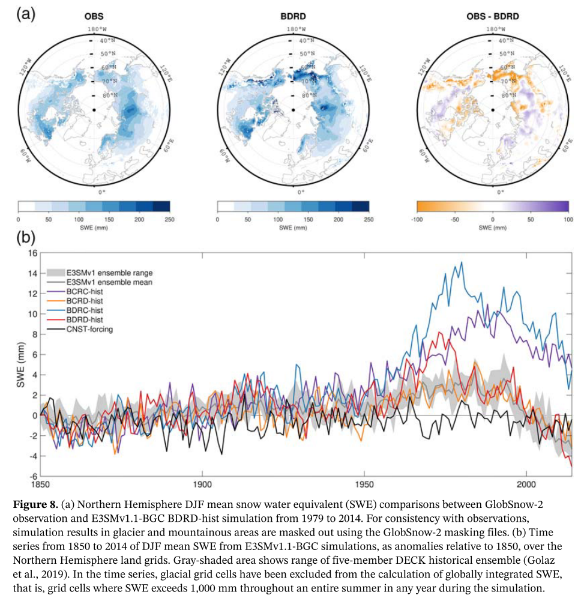

This paper documents the biogeochemistry configuration of the Energy Exascale Earth System Model (E3SM), E3SMv1.1_BGC. The model simulates historical carbon cycle dynamics, including carbon losses predicted in response to land use and land cover change, and the responses of the carbon cycle to changes in climate

[Link to the paper](https://doi.org/10.1029/2019MS001766)

Recommended citation: Burrows, S. M., Maltrud, M., Yang, X., Zhu, Q., Jeffery, N., Shi, X., Ricciuto, D., Wang, S., Bisht, G., Tang, J., Wolfe, J., Harrop, B. E., Singh, B., Brent, L., Baldwin, S., Zhou, T., CameronSmith, P., Keen, N., Collier, N., . . . Leung, L. R. (2020). The DOE E3SM v1.1 Biogeochemistry Configuration: Description and Simulated Ecosystem?Climate Responses to Historical Changes in Forcing. Journal of Advances in Modeling Earth Systems, 12(9).