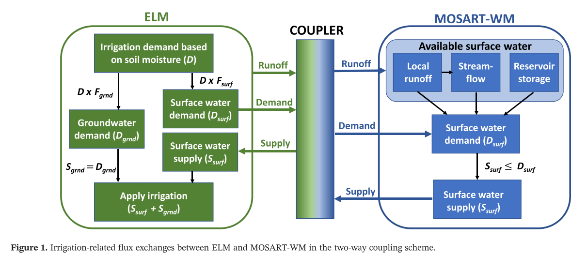

This paper introduces a two_way coupled irrigation scheme developed within the Energy Exascale Earth System Model (E3SM). The new irrigation scheme simulates irrigation water demand and applies irrigation water in E3SM Land Model (ELM), which is coupled to a river routing model and a water management model (MOSART_WM) that simulate streamflow, reservoir operations, and irrigation water supply

[Link to the paper](https://doi.org/10.1029/2020MS002069)

Recommended citation: Zhou, T., Leung, L. R., Leng, G., Voisin, N., Li, H. Y., Craig, A. P., Tesfa, T., & Mao, Y. (2020). Global Irrigation Characteristics and Effects Simulated by Fully Coupled Land Surface, River, and Water Management Models in E3SM. Journal of Advances in Modeling Earth Systems, 12(10).