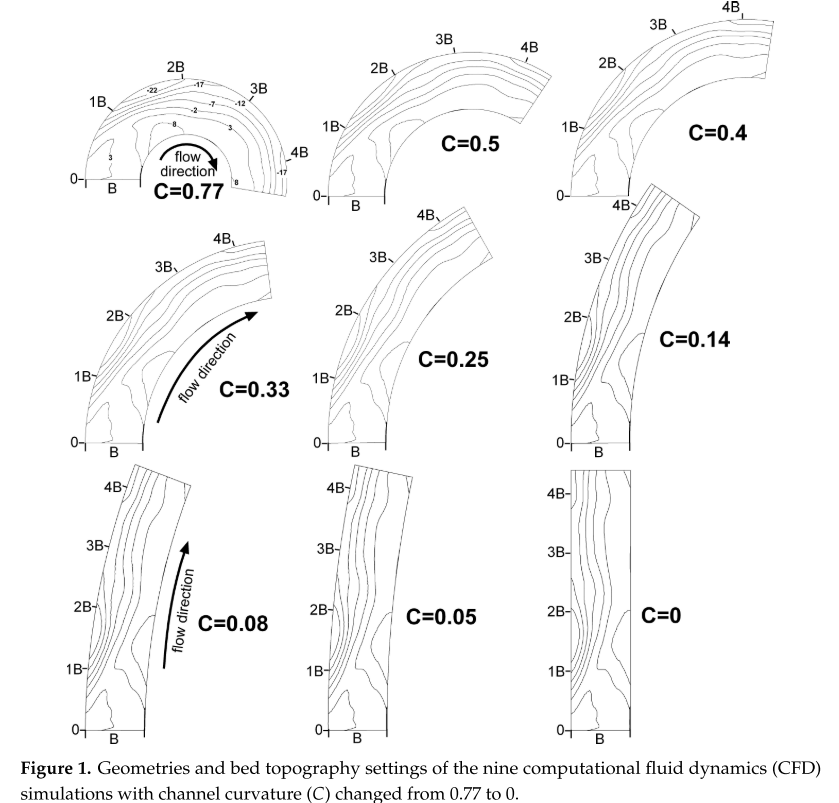

This paper was the last chapter of my PhD dissertation. We made a few attempts to publish the work and finally got accepted by Water. This study investigates the meander hydrodynamic changes with regard to the channel curvature

[Link to the paper](https://doi.org/10.3390/w12061680)

Recommended citation: Zhou, T., & Endreny, T. (2020). The Straightening of a River Meander Leads to Extensive Losses in Flow Complexity and Ecosystem Services. Water, 12(6). 