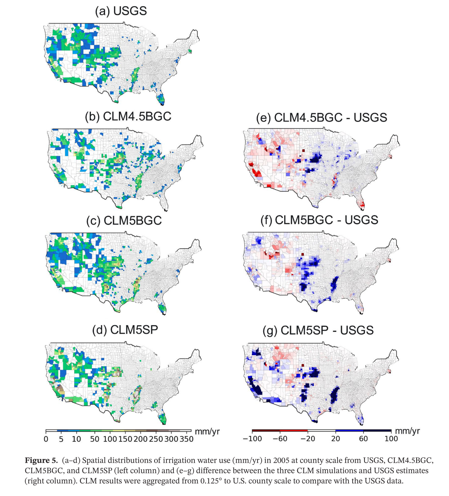

This paper validates the CLM5 results with different configurations

[Link to the paper](https://doi.org/10.1029/2020JD033539)

Recommended citation: Cheng, Y., Huang, M., Zhu, B., Bisht, G., Zhou, T., Liu, Y., Song, F., & He, X. (2021). Validation of the Community Land Model Version 5 Over the Contiguous United States (CONUS) Using In Situ and Remote Sensing Data Sets. Journal of Geophysical Research: Atmospheres, 126(5).