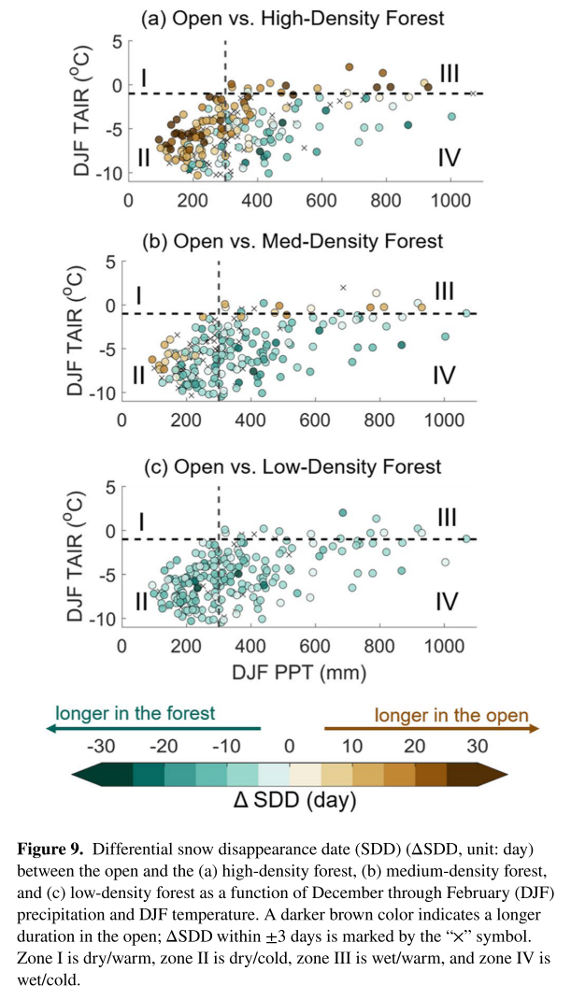

This paper investigates the forest canopy impacts on snow dynamics

[Link to the paper](https://doi.org/10.1029/2020WR029194)

Recommended citation: Sun, N., Yan, H., Wigmosta, M. S., Lundquist, J., Dickerson?Lange, S., & Zhou, T. (2022). Forest Canopy Density Effects on Snowpack Across the Climate Gradients of the Western United States Mountain Ranges. Water Resources Research, 58(1). 