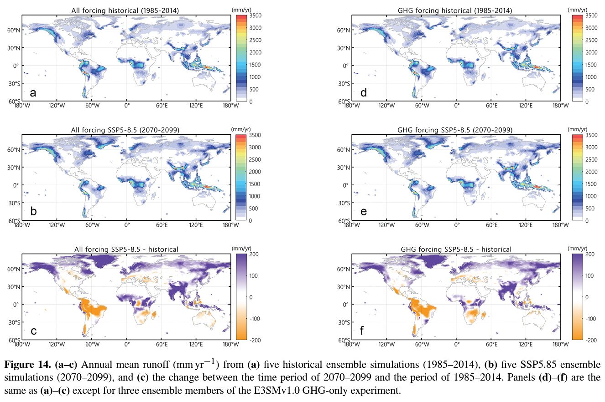

This paper documents the E3SM v1 simulation for ScenarioMIP and examines the forcing impacts

[Link to the paper](https://doi:10.5194/gmd-15-3941-2022)

Recommended citation: Zheng, X., Li, Q., Zhou, T., Tang, Q., Van Roekel, L. P., Golaz, J.-C., Wang, H., & Cameron-Smith, P. (2022). Description of historical and future projection simulations by the global coupled E3SMv1.0 model as used in CMIP6. Geoscientific Model Development, 15(9), 3941-3967.