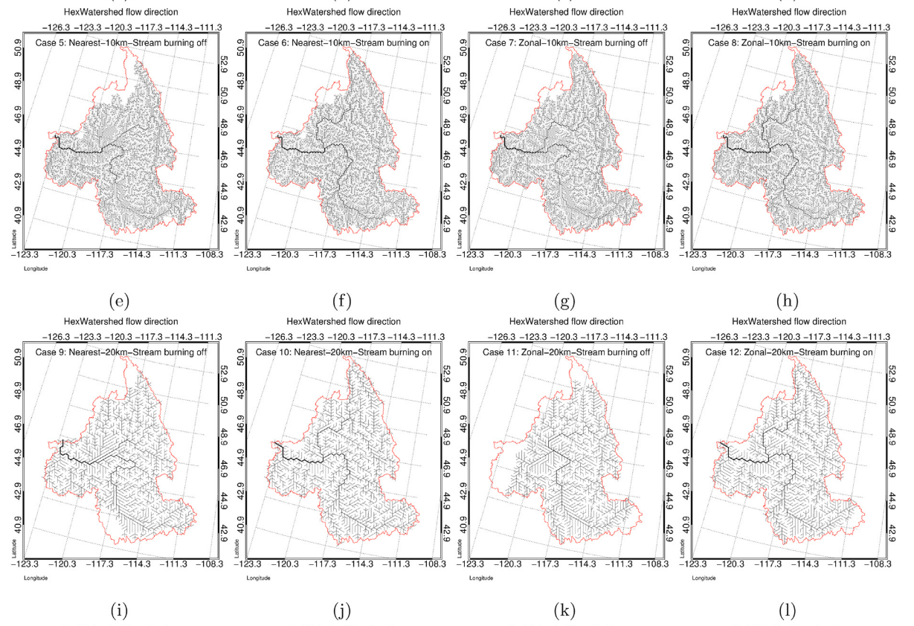

This paper introduces HexWatershed, a tool to generate flow network on hexagonal grids

[Link to the paper](https://doi.org/10.1016/j.advwatres.2021.104099)

Recommended citation: Liao, C., Zhou, T., Xu, D., Barnes, R., Bisht, G., Li, H.-Y., Tan, Z., Tesfa, T., Duan, Z., Engwirda, D., & Leung, L. R. (2022). Advances in hexagon mesh-based flow direction modeling. Advances in Water Resources, 160.