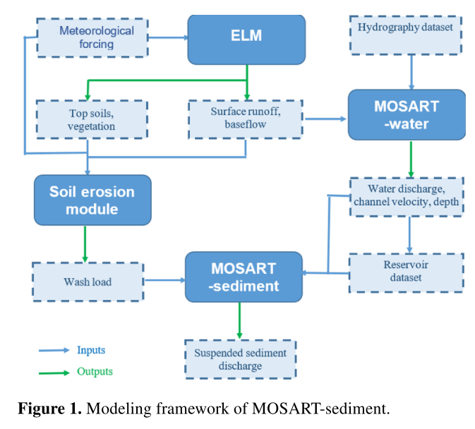

This paper introduces MOSART-sediment scheme

[Link to the paper](https://doi.org/10.5194/hess-26-665-2022)

Recommended citation: Li, H.-Y., Tan, Z., Ma, H., Zhu, Z., Abeshu, G. W., Zhu, S., Cohen, S., Zhou, T., Xu, D., & Leung, L. R. (2022). A new large-scale suspended sediment model and its application over the United States. Hydrology and Earth System Sciences, 26(3), 665-688.