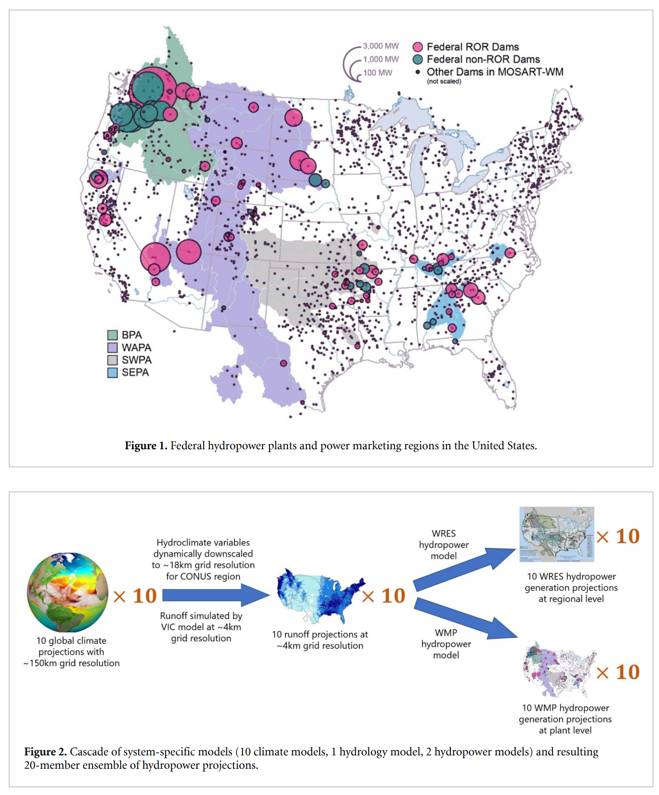

This study introduces a conceptural reseroir operation-hydropower model in a multi-model assessment toolchain to evaluate the compounded impact of climate on monthly US federal hydropower generations

[Link to the paper](https://doi.org/10.1088/1748-9326/acb58d )

Recommended citation: Zhou, T., Kao, S.-C., Xu, W., Gangrade, S., & Voisin, N. (2023). Impacts of climate change on subannual hydropower generation: a multi-model assessment of the United States federal hydropower plant. Environmental Research Letters, 18(3). 