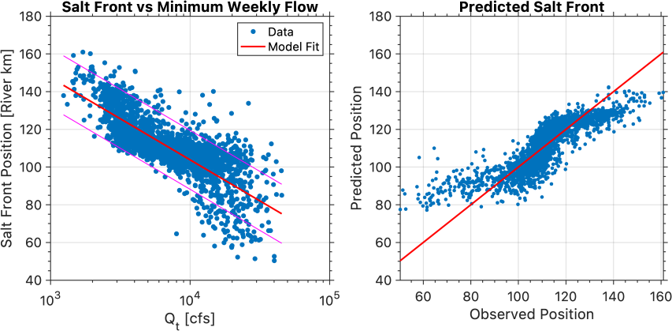

<!-- _class: title -->
<!-- _paginate: skip -->

# Modeling Inter-Basin Water Transfers in E3SM

## Tian Zhou, Matt Cooper, Chang Liao, Donghui Xu, Darren Engwirda, Ning Sun, Zeli Tan, Hong-Yi Li, Dongyu Feng, Gautam Bisht, and L. Ruby Leung
 

### 1/11/2024

---
# Background
- Saltwater intrusion in Delaware River Basin (DRB)
- What role Inter-Basin Water Transfer (IBT) is playing

---
# IBT in Delaware River Basin

Up to 800 Million Gallons per Day (MGD) of water extracted for NYC through (IBT)

---

---
# A data-driven IBT scheme in MOSART-WM

- Reservoir to reservoir transfer
- Monthly water transfer at each reservoir is provided by external files
- Mass is conserved 
- Limitations
  - No transfer loss
  - Instantaneous transfer
  - Consumptive use is not represented

---

---

An empirical relationship (R2=0.71) between the weekly maximum salt front position (SF, km from the estuary) and the weekly minimum river discharge (Q, cfs) at Trenton, NJ can be established based on the long-term observation from DRBC:
          𝑆𝐹=278−4.4×log⁡(𝑄_𝑡 )−14.6×log⁡(𝑄_(𝑡−1) )

---
# IBT Leads to Enhanced Saltwater Intrusion

- IBT could push the maximum salt front location upstream by nearly 8 km 
- The findings also highlight the critical need to incorporate IBT into models that assess human impacts on large-scale hydrologic processes

---
<!-- _class: title -->
<!-- _paginate: skip -->

# Thank you!
---